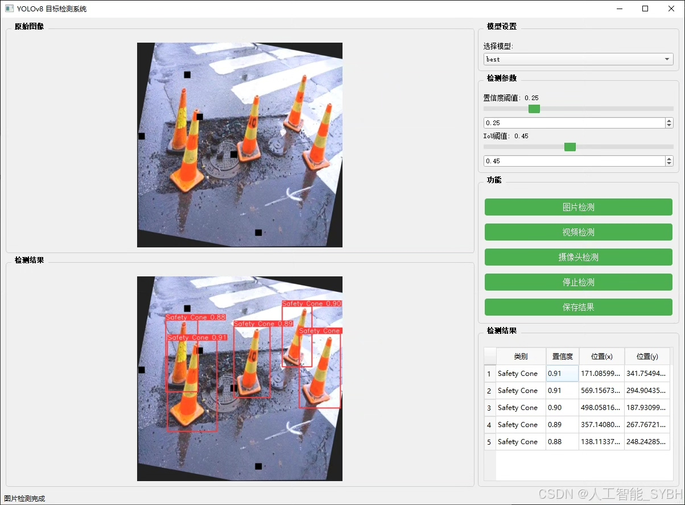
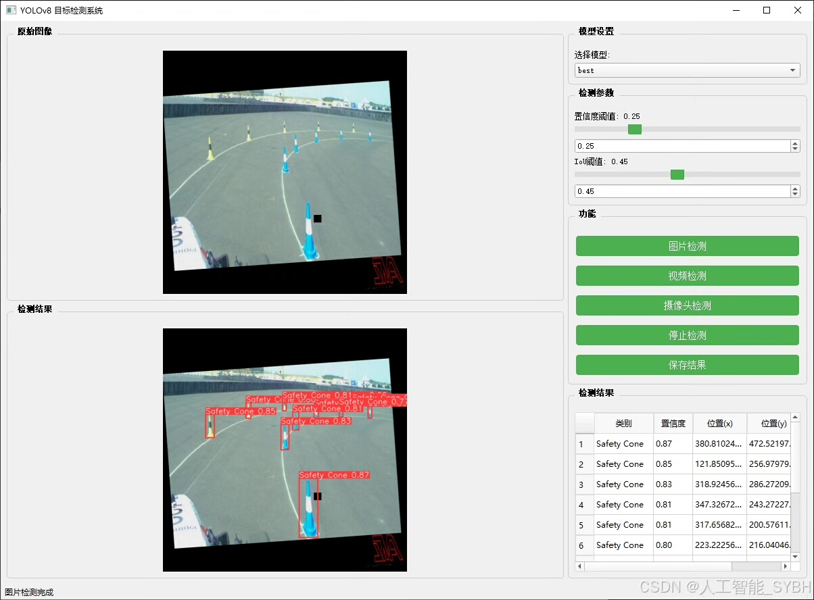
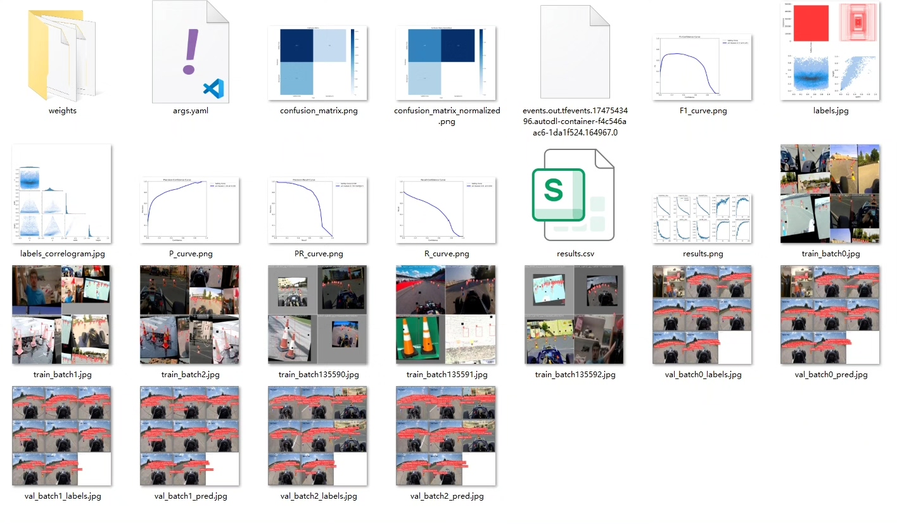
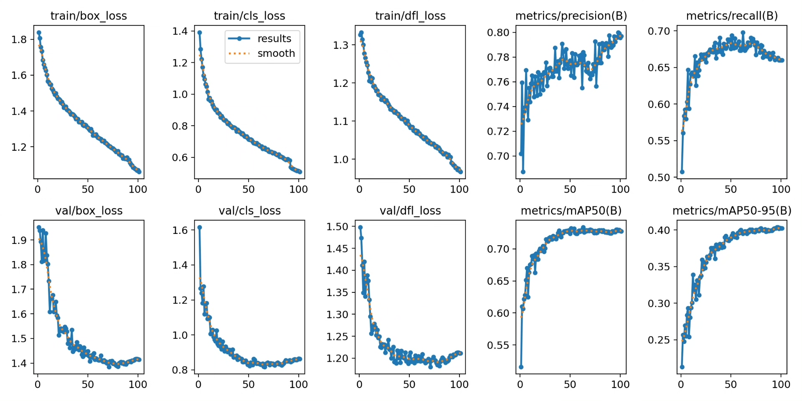
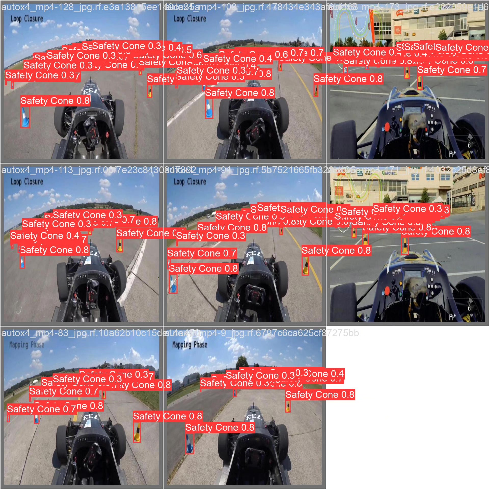
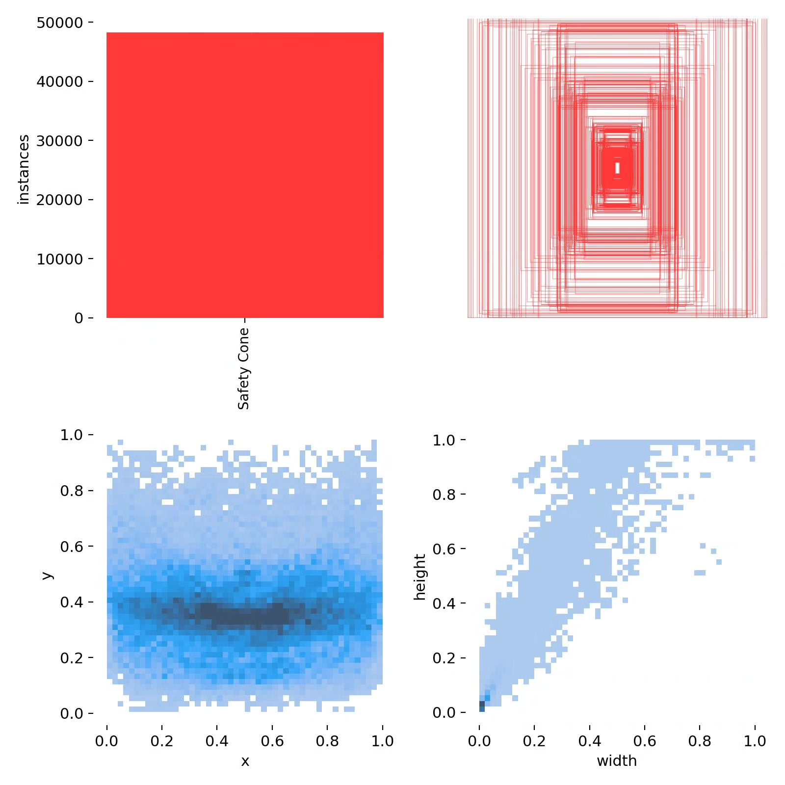
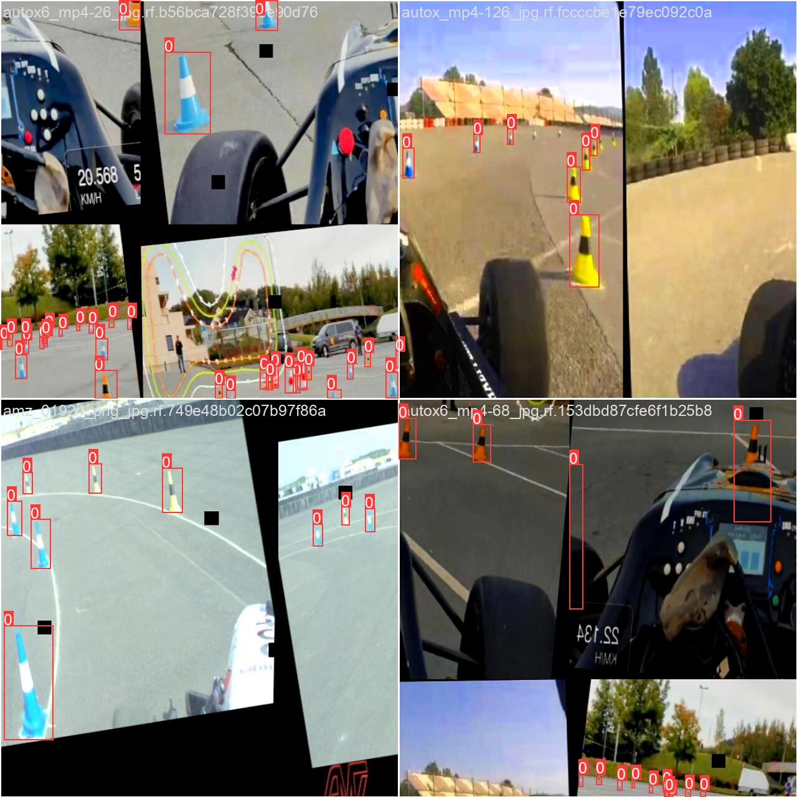

# Based on deep learning YOLOv8, a safety cone recognition detection system (YOLOv8+)

## Body

Based on the cutting-edge YOLOv8 object detection algorithm, this project has developed a highly efficient and precise safety cone recognition detection system. It is specifically designed for identifying safety cone facilities in road construction, accident scenes, etc. The system utilizes deep learning techniques, training and optimizing the model on a professional dataset containing 5,960 training images, 341 validation images, and 170 test images to ensure high accuracy in detecting safety cones under various complex road environments.

The company's products have obtained official commercial license certification from YOLO.

We provide after-sales service.

After payment, we will provide WeChat IDs for instant questions and answers.

Environmental configuration: We will provide an environmental configuration tutorial, with WeChat available for Q&A.

Remote installation services: If you need remote configuration of the environment, an additional fee of 69 is required.
If the configuration fails, all fees will be refunded (specially for older computers only refund installation fees).

Retraining dataset: After setting up the environment, you can train on your own computer.
If you need us to retrain, just pay 69 plus computing power fees (2.5 yuan/hour)

## Images

## Payment

Here is a pay link on Stripe ( https://buy.stripe.com/3cs8yP7sY87d0vu9AB ). Please contact me lonlonago@foxmail.com after funding $89, and I will send you a complete data files , thank you!

